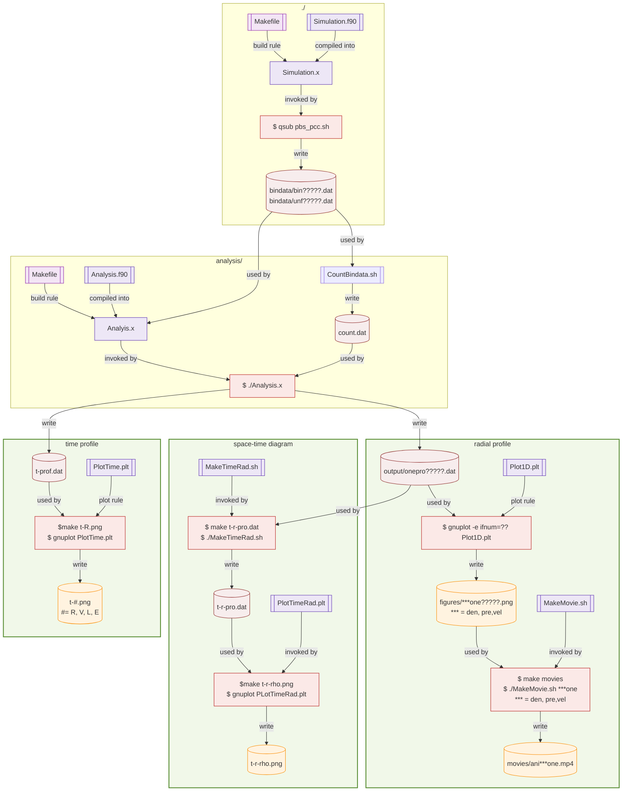

# 1D Blastwave simulation

[Go to top](../README.md)  

## How to run and analyze

This manual describes how to run the simulation and how to analyze the data you obtained by the simulations.
Following the proceadure, you will confirm that the simulation code runs correctly, and learn how to visualize the basic outputs of the 1D blast-wave simulation. You are NOT required to understand the details of the code or the physics at this stage.

### login and go to work directory 
First login the server, `w000.cfca.nao.ac.jp`.

    ssh <your account>@w000.cfca.nao.ac.jp
    
Then, go to work directory. Make it if that does not exist.

    mkdir /mwork1/<your account>
    cd /mwork1/<your account>

Copy the programs. 
    
    cp -r /mwork1/takiwkkz/Blastwave .

Keep the original program as it is, so that you can always return to a clean reference model.
    
    cd Blastwave/
    mv HYD1D HYD1D_original
   
### Making your model 
Start the simulation by copying the original file. You can name the directory as you like. `_model1` is an example. It is recommended to include information about the model (e.g. density or energy) in the directory name.
    
    cp -r HYD1D_original HYD1D_model1
    cd HYD1D_model1

### compile 
To run the code, you need to compile `Simulation.f90`.
    
    module load intel/2024
    make Simulation.x
    
Then `Simulation.x`is made in this directory.

### run
Let's run the code.
    
    qsub pbs_pcc.sh
    
The simulation data is saved in `bindata/`.
    
    ls bindata/
    
### analysis
Open another terminal and go to analysis server, `an??.cfca.nao.ac.jp`. Here ?? is 09-14. You can choose any available server (e.g. an09–an14).To analyze the data, let us make `Analysis.x`.
    
    ssh <your account>@an??.cfca.nao.ac.jp

Then go to the work directory. Change `_model1` to the name you used.
    
    cd /mwork1/<your account>/Blastwave/HYD1D_model1/analysis
    make Analysis.x
    
Now you have many time-snapshots of data. To count it, use a script.
    
    ./CountBindata.sh
   
See the file, `cat control.dat`. You can know the number of files.
Now the preparation for analysis is done. Run the analysis program.
    
    ./Analysis.x
    
The output is saved in `output/`.
    
    ls output/
    
### 1D plots and animation.
If you need 1D snapshots, use the following command. Using `output/onepro*.dat` (1DProfile), image files are made and save as `figures/*.png` (e.g., `denone00010.png`).
    
    gnuplot -e ifnum=10 Plot1D.plt
    ls figures/
    display figures/denone00010.png
    display figures/preone00010.png
    display figures/velone00010.png
    
If 'display' does not work, please copy the files to your local machine and open them there.
Compare the figure with the following one.

    gnuplot
    gnuplot> plot "output/onepro00050.dat" u 1:2 w l title "density"
    gnuplot> plot "output/onepro00050.dat" u 1:3 w l title "pressure"
    gnuplot> plot "output/onepro00050.dat" u 1:4 w l title "velocity"
    
    
All snapshots are made by the following command. 
    
    make 1Dsnaps
   
To make movie from the files. Type as follows.

    make movie
   
The movie files in saved in `movies/`. You can see the movie with the following command.

    ls movies/
    mplayer movies/ani???.mp4

If 'mplayer' does not work, please copy the files to your local machine and open them there.
### See the time evolution
Following command create time evolution of some variables. Confirm that the file is made.

    make t-R.png
    ls t-R.png
    
### Space Time Diagram
Following command create space-time diagram. Confirm that the file is made.

    make t-r-rho.png
    display t-r-rho.png
    
Compare the figure with the following one.

    gnuplot
    gnuplot> set view map
    gnuplot> set title "density"
    gnuplot> splot "t-r-pro.dat" u 1:2:3 w pm3d
    
### Run all analysis steps at once
To do all in one command, you just type `make` or `make all`.
   
      make all
      
If you want to delete all the analysis, type `make allclean`
# How to change the parameters
Let us try to change the parameters. Before doing so, confirm that you are logged in `w000.cfca.nao.ac.jp`.
If you are still in the directory where `Simulation.x` exists, change the directory.

    cd ..
    ls

You may find the following directories.

    HYD1D_original HYD1D_model1
    
As you did it, you start the simulation by copying the original program. Here `_model2` is an example. If that already exists, change the name, e.g., `_model3`, `_model4`.  
    
    cp -r HYD1D_original HYD1D_model2
    cd HYD1D_model2

Now you are in `HYD1D_model2`. You can change the number of numerical grid in `module commons` in `Simulation.f90`.
<pre>
      integer,parameter::izones=200
</pre>
Also you can change the timescale and simulation region.
<pre>
      real(8),parameter:: timemax=2.0d3*year
      real(8),parameter:: x1min=0.0d0,x1max=10.0d0*pc
</pre>
In `subroutine GenerateProblem`, you can find the following part.
You can change the parameters as you like.

<pre>
      ! parameter
      Mejcta = 5.0d0*Msolar
      Eexp = 1.0*foe
      frac = 0.5d0
      Ekin = frac*Eexp
      Eth  = (1.0d0-frac)*Eexp
      timezero = 10.0d0 * year
      nmedium = 1.0d0 !! interstellar medium [1/cm^3]
      
      print *, " Mej  = ",Mejcta/Msolar," [M_s]"
      print *, " Eexp = ",Eexp/foe     ," [10^51 erg]"
      print *, " Ekin = ",Ekin/foe     ," [10^51 erg]"
      print *, " Eth  = ",Eth /foe     ," [10^51 erg]"
      print *, " t_0  = ",timezero/year," [year]"
      print *, "n_ism = ",nmedium      ," [1/cm^3]"
</pre>
After editing `Simulation.f90`, compile the code.

# Graphical Summary

We show a graphical summary of the data analysis pipe line.

