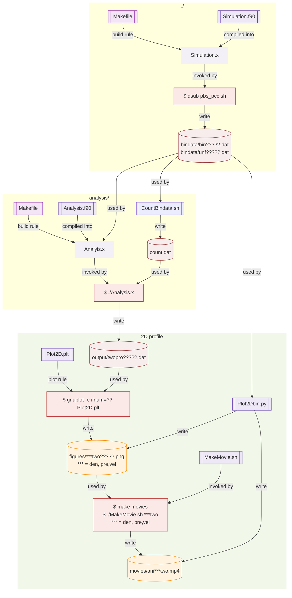

# 2D Blastwave simulation

[Go to top](../README.md)  

## How to run and analyze

This manual describes how to run the simulation and how to analyze the data you obtained by the simulations. Following the proceadure, you will confirm that the simulation code runs correctly, and learn how to visualize the basic outputs of the 1D blast-wave simulation. You are NOT required to understand the details of the code or the physics at this stage.

### login and go to work directory 
First login the server, `m000.cfca.nao.ac.jp`.

    ssh <your account>@m000.cfca.nao.ac.jp
    
Then, go to work directory. Make it if that does not exist.

    mkdir /mwork2/<your account>
    cd /mwork2/<your account>

Copy the programs.　If you did not do it before. 
    
    cp -r /mwork2/dos31/Blastwave .

Keep the original program as it is, so that you can always return to a clean reference model.
    
    cd Blastwave/
    mv HYD2D HYD2D_original
   
### Making your model 
Start the simulation by copying the original file. You can name the directory as you like. _model1 is an example. It is recommended to include information about the model (e.g. density or energy) in the directory name.
    
    cp -r HYD2D_original HYDD_model1
    cd HYD2D_model1


### compile 
To run the code, you need to compile `Simulation.f90`.
    
    module load intel/2022
    make Simulation.x
    
Then `Simulation.x` is made in this directory.

### run
Let's run the code.
    
    qsub pbs_more.sh
    
The simulation data is saved in `bindata/`.
    
    ls bindata/
    
### analysis
Open another terminal and go to analysis server, an??.cfca.nao.ac.jp. Here ?? is 09-14. You can choose any available server (e.g. an09–an14).To analyze the data, let us make Analysis.x.
    
    ssh <your account>@an??.cfca.nao.ac.jp

Then go to the work directory. Change `_model1` to the name you used.
    
    cd /mwork2/<your account>/Blastwave/HYD2D_model1/analysis
    make Analysis.x
    
Now you have many time-snapshots of data. To count it, use a script.
    
    ./CountBindata.sh
    cat control.dat
   
See the file, `cat control.dat`. You can know the number of files.
Then preparation is done. Run the analyis.
    
    ./Analyis.x
    
The output is saved in `output/`.
    
    ls output/
    
### 2D plots and animation.
If you need 2D snapshots, use the following command. Using `output/twopro*.dat` (2D Profile), image files are made and save as `figures/*.png` (e.g., `dentwo00010.png`).
    
    gnuplot -e ifnum=10 Plot2D.plt
    ls figures/
    display figures/dentwo00010.png
    display figures/pretwo00010.png
    display figures/veltwo00010.png

Compare the figure with the following one.

    gnuplot
    gnuplot> set view map
    gnuplot> set title "density"
    gnuplot> splot "output/twopro00010.dat" u 1:2:3 w pm3d
    
All snapshots are made by the following command. 
    
    make 2Dsnaps
   
To make movie from the files. Type as follows.

    make movie
   
The movie files in saved in `movies/`. You can see the movie with the following command.

    ls movies/
    mplayor movies/ani???.mp4

You can also use python scripts to make the figures and movies.
```bash
python Plot2Dbin.py
```
### Run all analysis steps at once
To do all in one command, you just type `make` or `make all`.
   
      make all
      
If you want th delete all the analysis, type `make allclean`


# Graphical Summary

We show a graphical summary of the data analysis pipeline.



